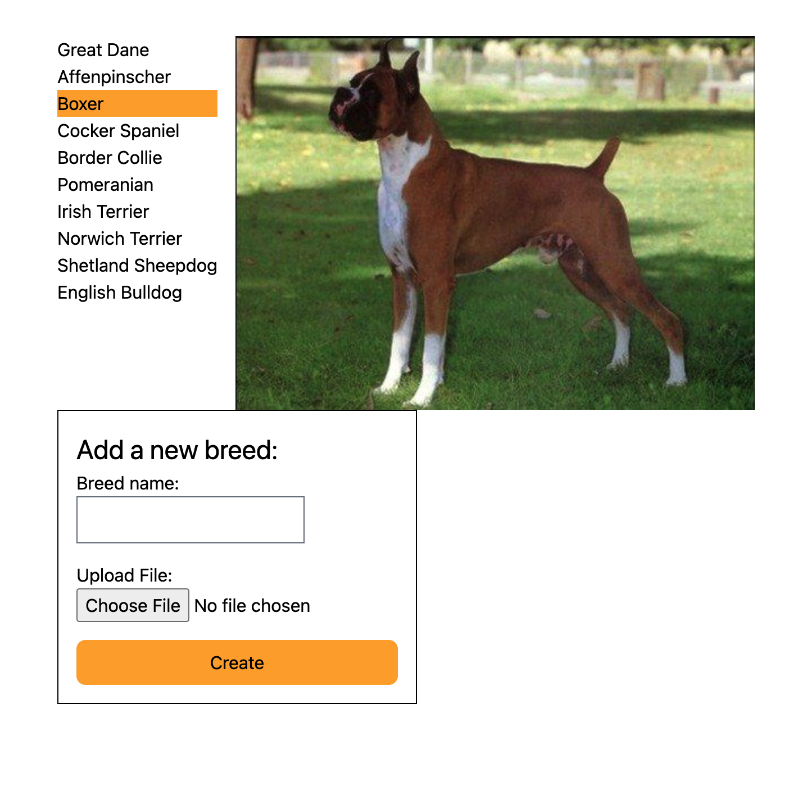

# Kate Leahy's Vetspire Takehome

This was fun! Some notes on my implementation:

- I structured this app in a way that I felt provides flexibility for future changes, since it seemed like
  there were some natural areas where we would likely consider adding features in the future, but at this moment
  we don't know what changes we will make. My goal was to build what was being requested but make the architecture
  somewhat agnostic. For example, currently we only show dog breeds, but there are obviously lots more animals that
  have "breeds", so I intentionally didn't use the word "dog" in any of the models. In fact when I first generated
  this app I gave it the very uninspired name `DogBreeds`, but I later renamed it `Linnaeus` (after Carl Linnaeus,
  the man who came up with the concept of biological taxonomy).
- I also tried to keep the concept of breeds and images separate. Currently there is a 1:1 relationship of images to
  breeds, but that could easily change in the future. So, I did add a `has_one :image` relation to the Breed schema, but
  I did not add an `image_id` column to the breed table; instead I put a `breed_id` column on the image table. That
  way if we decided in the future to change to a `has_many :images` relation it would require minimal changes.
- Additionally, I structured the json response in the controller to be 2 separate hashmaps of breeds and images,
  instead of nesting images inside of breeds. This is maybe a bit unnecessary, but in general I like that style of
  providing related data to the frontend, essentially giving it a mini database.
- I initially intended to build out a service to upload to a real CDN, but I decided not to because I wound up
spending more time on other areas of the implementation. However I structured the uploader as a `behaviour`, and
the uploader to use is set in the config, so it would be pretty simple to add a CDN service. It also doesn't currently
do any kind of size verification or security checks before saving the file, which is definitely something I would want
to implement in production. (The frontend does limit the file selector to only images.)
- I added a small mix task to seed the database: `mix linneaus.seed_db`
- My frontend is extremely simple and only has a tiny bit of styling - I used inline styles because I got lazy.
  (I've used tailwind a bit but I'm still new to it, plain CSS is still my go-to for simple projects.)
  If I were building this for real I would use something more robust like tailwind or styled components.
- I decided to write this in React on the front end because I know Vetspire uses it and I wanted to show my skills.
  However if I were writing this app for real, I think React would be overkill here - there's simply not enough complexity
  to justify it, and depending on what kind of SEO needs we had, it could be actively detrimental. You certainly could
  add in server-side rendering, but again that seems like a lot of extra implementation complexity for no good reason.

## Vetspire Take-home (max 2 hours)

Fork this repo. Build a simple full stack app using frameworks of your choice. Submit your results as a pull request
to this repo with instruction on how to build/run it or, even better, a link to where we can see it already
running/deployed. Alternatively, feel free to send us an archive file of the work.

There is probably more here than can be finished in two hours. Don't worry about completeness. Focus on what's 
important and interesting to you.   

We use `Elixir`, `Ecto`, `Absinthe`, `GraphQL`, `Typescript/Javascript` and `React` at Vetspire but you are welcome to use 
whatever languages and frameworks you prefer.

We encourage you to include a README with notes about your language and framework choices as well as your design 
decisions.

### Features
- Backend API that serves:
    - A list of available dog breeds based on those available in `/images`
    - Individual dog images by breed
- Frontend UI that provides:
    - A list of dog breeds
    - The ability to choose a breed and display the image for it
- Bonus Feature:
  - Ability to add a new breed with a new image
